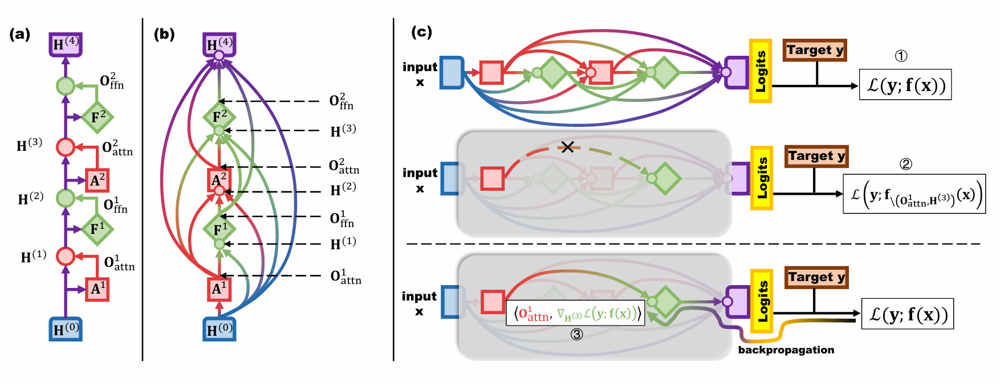

# Reinforcement Learning Fine-Tuning Enhances Activation Intensity and Diversity in the Internal Circuitry of LLMs

[](https://arxiv.org/abs/2509.21044)
[](LICENSE)


This repository contains the official implementation for the paper **"Reinforcement Learning Fine-Tuning Enhances Activation Intensity and Diversity in the Internal Circuitry of LLMs"** (ICLR 2026).



## 📂 Repository Structure

The repository is organized as follows:

- `src/`: Core implementation of the analysis framework.
  - `eap/`: Modified version of Edge Attribution Patching (EAP) for coarser-grained graph-based analysis of LLMs, extending to more general question-answering behavior.
  - `transformer_lens/`: Modified version of TransformerLens for model hooking and caching.
- `evaluation/`: Scripts for evaluating model performance on mathematical benchmarks (GSM8K, MATH, etc.).
- `training_dynamics_exp/`: Experiments related to RL training dynamics.
- `run_tests.py`: Main script for running the probing analysis.
- `run.sh`: Shell script to reproduce the experiments across different model series.

## 🛠️ Installation

### Prerequisites

- Python >= 3.10
- PyTorch >= 2.0
- CUDA Version: 12.2 (Tested on NVIDIA A100)

### Setup

1. Clone this repository:

   ```bash
   git clone [https://github.com/tsinghua-fib-lab/llm_rl_probing_analysis.git](https://github.com/tsinghua-fib-lab/llm_rl_probing_analysis.git)
   cd llm_rl_probing_analysis
   ```

1. Install dependencies:

   ```bash
   pip install -r requirements.txt
   ```

   *Note: This project relies on `transformer_lens`, `accelerate`, and `transformers`.*

2. Install the latex parsing utility (required for math evaluation):

   ```bash
   cd evaluation/latex2sympy
   pip install -e .
   cd ../..
   ```

## 🚀 Usage

### 1. Circuitry Analysis (EAP)

To analyze the internal differences between Base (SFT) and RL models, use the `run_tests.py` script. You can use the provided `run.sh` script to reproduce the results for the models mentioned in the paper.

#### Parameters

- `--dataset_name`: Target dataset (e.g., 'math', 'gsm8k').
- `--model_series`: The family of the model (e.g., 'deepseek', 'mistral', 'qwen', 'nvidia-qwen').
- `--model_type`: 'base' (SFT) or 'rl' (Post-trained).
- `--cut_coeff`: Truncation length coefficient ($\alpha$).

#### Example: Analyzing DeepSeek-Math

```bash
# Set parameters (See paper Appendix C for details)
export DATASET_NAME='math'
export CUT_COEFF=0.05
export NUM_SAMPLES=100

# Analyze SFT Model
python3 -u run_tests.py \
    --dataset_name ${DATASET_NAME} \
    --model_series 'deepseek' \
    --model_name 'deepseek-ai/deepseek-math-7b-instruct' \
    --model_type 'base' \
    --cut_coeff ${CUT_COEFF} \
    --num_samples ${NUM_SAMPLES}

# Analyze RL Model
python3 -u run_tests.py \
    --dataset_name ${DATASET_NAME} \
    --model_series 'deepseek' \
    --model_name 'deepseek-ai/deepseek-math-7b-rl' \
    --model_type 'rl' \
    --cut_coeff ${CUT_COEFF} \
    --num_samples ${NUM_SAMPLES}
```

### 2. Performance Evaluation

To evaluate the mathematical reasoning performance of the models (as shown in Table 4 of the paper), navigate to the `evaluation/` directory.

```bash
cd evaluation

# Example: Evaluating Qwen2.5-Math-7B-Instruct
export CUDA_VISIBLE_DEVICES="0"
bash sh/eval.sh qwen25-math-cot Qwen/Qwen2.5-Math-7B-Instruct
```

Supported prompt types and models are detailed in `evaluation/README.md`.

### 3. Training Dynamics Experiment

The code for the sampling temperature intervention experiment (Appendix B) is located in `training_dynamics_exp/`.

## 📊 Supported Models

The codebase supports analysis for the following model pairs used in the paper:

| **Model Series**   | **Base Model (SFT)**          | **RL Model**                  | **Method** |
| ------------------ | ----------------------------- | ----------------------------- | ---------- |
| **DeepSeek-Math**  | `deepseek-math-7b-instruct`   | `deepseek-math-7b-rl`         | GRPO       |
| **Mistral**        | `mistral-7b-sft`              | `math-shepherd-mistral-7b-rl` | PPO        |
| **Distilled-Qwen** | `DeepSeek-R1-Distill-Qwen-7B` | `AceReason-Nemotron-7B`       | GRPO       |
| **Qwen2.5**        | `Qwen2.5-7B-SFT`              | `Qwen2.5-7B-DPO`              | DPO        |

*Note: Ensure you have access to Hugging Face Hub to download these models automatically, or update the paths in `run.sh` to point to your local checkpoints.*

## 🔗 Citation

If you find this code or paper useful for your research, please cite:

```
@inproceedings{zhang2026reinforcement,
  title={Reinforcement Learning Fine-Tuning Enhances Activation Intensity and Diversity in the Internal Circuitry of LLMs},
  author={Zhang, Honglin and Hao, Qianyue and Xu, Fengli and Li, Yong},
  booktitle={The Fourteenth International Conference on Learning Representations},
  year={2026}
}
```

## 📄 License

This project is licensed under the MIT License.

## 🙏 Acknowledgements

We thank the developers of the following libraries, which enabled this research:

- [TransformerLens](https://github.com/neelnanda-io/TransformerLens) and [EAP-IG](https://github.com/hannamw/eap-ig) for mechanistic interpretability tools.
- [Math Evaluation Harness](https://github.com/ZubinGou/math-evaluation-harness) and [Qwen2.5-Math](https://github.com/QwenLM/Qwen2.5-Math) for the evaluation framework.
- [Unsloth](https://github.com/unslothai/unsloth) and [TRL](https://github.com/huggingface/trl) for simple and efficient RL-based post-training.

